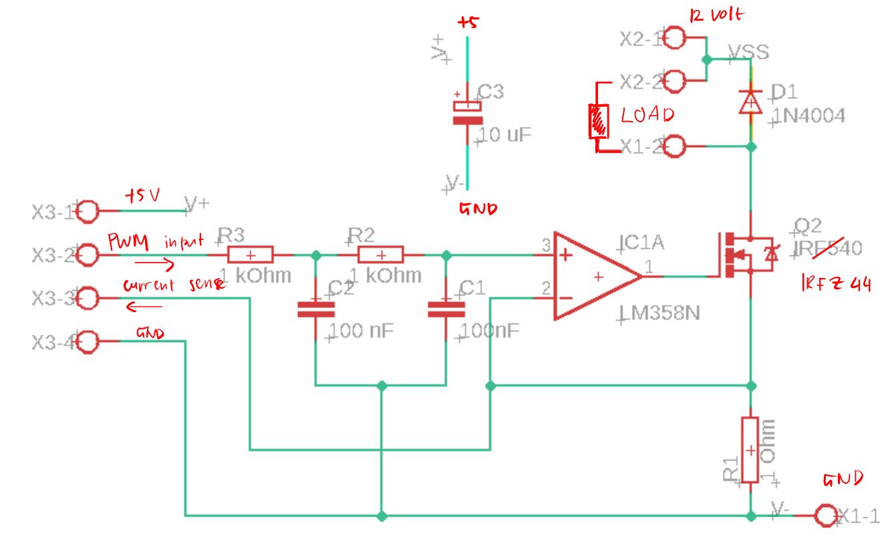
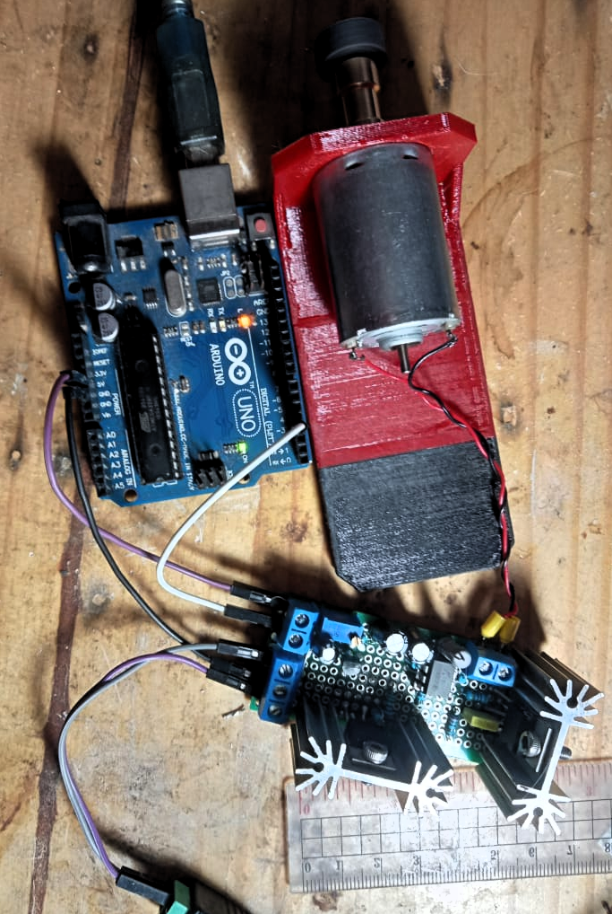
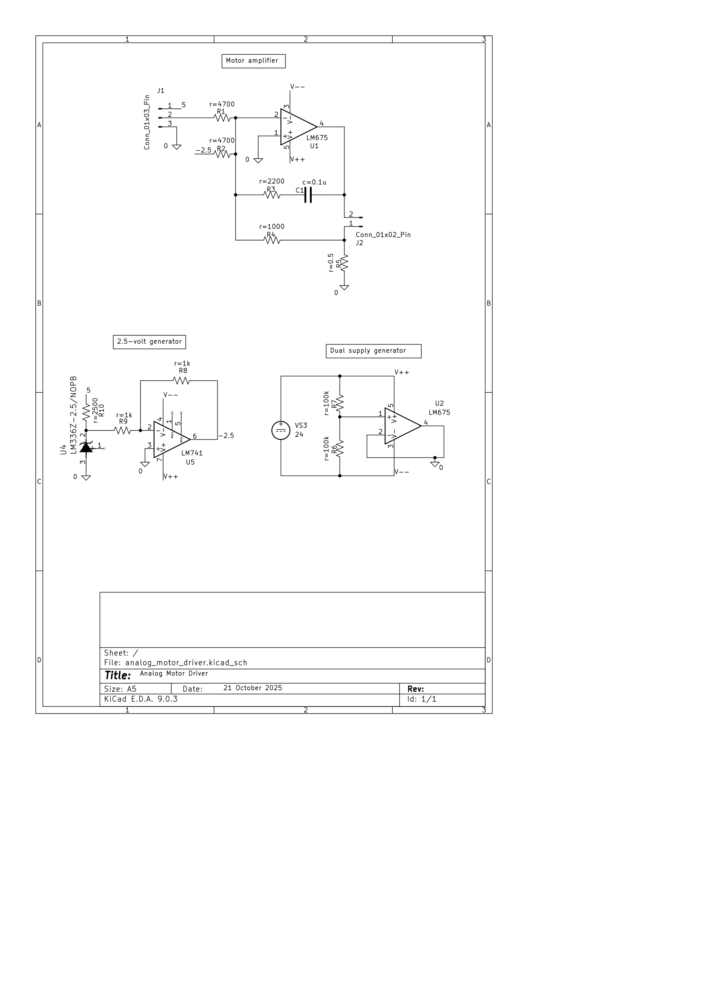

# constant-current-drive

This is a simple circuit for sending constant current to a load, even if the load is varying over time.

## Single-directional drive

### Schematic
This picture below shows the current-sink configuration. In the **ltspice folder**, the more common current-source configuration is used for simulations.  

Note: replace IRF540 with IRFZ44N   

### PCB

## Two-directional drive

